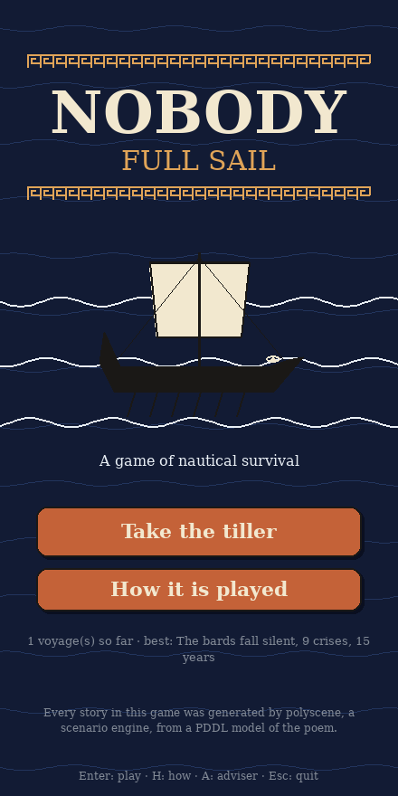
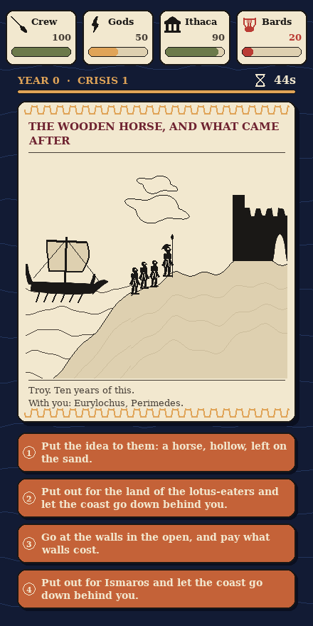
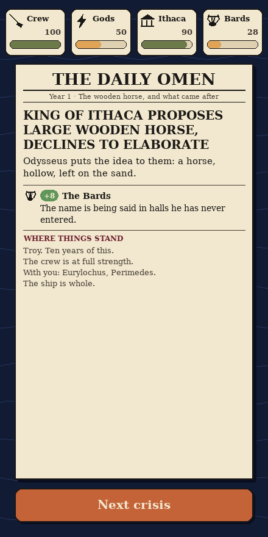

# Nobody: Full Sail

A game of nautical survival in the manner of *No. 10: Full Confidence*
— four factions along the top, a crisis on a card, three answers, a
clock running down, and a front page after every decision — with one
difference: **nothing in it was written in advance.** Every crisis,
every answer and every road through the game was generated by
[polyscene](https://github.com/MFaisalZaki/polyscene), a scenario
engine, from a PDDL model of Homer's Odyssey. The engine found every
one of them sound; the game only lets you walk them.

| | | |
|---|---|---|
|  |  |  |

You are Odysseus. A crisis lands every scene, drawn: the island you
are on and what stands on it, the crew as so many men on the beach,
the ship or the raft or the wreckage, the sky as the gods' mood. You
have 45 seconds to answer it; every answer pleases somebody and costs
somebody else, and the answer under the pointer says what it does and
what it will cost:

| faction | what it is |
|---|---|
| **The Crew** | your own men. Losing them all is not the end — it is the poem — so this one cannot sink you |
| **The Gods** | fickle, well-armed, and reading everything you say |
| **Ithaca** | the household; the suitors are eating its patience |
| **The Bards** | your name. They were briefly singing about you |

Let a fatal faction hit the floor and it is over. Reach an ending the
poem allows — home and known, the god's bargain, the hall lost — and
the story closes on it. The score to beat is the poem's own: ten
years, home alone, every man lost, known by his wife.

## Playing

```sh
python3 -m venv venv
venv/bin/python -m pip install -e '.[test]'     # pygame-ce is all the game needs
venv/bin/python main.py play                     # the game
venv/bin/python main.py walk                     # the same game, in the terminal
venv/bin/python -m pytest tests                  # the suite
```

`play` opens a portrait window as large as the screen allows, clear
of the menu bar and the dock, and draws it at the display's full
resolution; drag a corner to resize it (`--scale 0.8` forces a size,
`--timer 90` gives more thinking time). Every answer is a sentence of
what you would be doing, in the poem's own voice; the green one is
the world's move, not yours. Keys: **1–4** answer, **↑ ↓** read an
answer before taking it (its passage, and what it costs whom),
**Enter** continue, **A** show what each answer will cost (the
"special adviser" of the original), **L** the log, **Esc** quit. When
it is over, **the road you took** charts every decision with the
roads not taken beside it; on the title, **R** charts **the roads you
have taken** over every voyage so far, merged into one tree, the
latest in red (the record lives in `~/.nobody/runs.json`). `stats`
says what the library holds; `shot DIR` renders every screen to PNG
files without a display (`--scale 2` for Retina-sharp ones).

A crisis is a board with something to decide on it. Where the library
offers one answer and the world has no move — putting to sea, the
raft, drifting to the nymph's island, the court that carries you home
— the story takes the passage and the paper reports it under *And
then*; the pack names these (`QUIET` in `worlds/odyssey/world.py`).
A lone answer it does not name (the descent to the dead, the nymph's
offer, the bow) is a board worth seeing, so it gets a front page of
its own, marked *the only road from there*, and counts as no crisis —
but never a menu of one.

## What is in the box

The game plays a **library**: `worlds/odyssey/library.json`, a graph of
16,159 boards joined by 16,158 beats, grown by the engine and shipped
here so that playing needs no engine at all. A node is a state of the
world; an edge is one ground beat the engine told from that state. At a
node the hero's own beats are the answers, the world's beats are what
happens when nobody decides, and a node on one of the poem's terminal
lines is an ending. The library holds 3,195 complete roads from Troy:
856 close on an ending (809 the hall lost, 46 the god's bargain, and
one homecoming — the poem's own road in 22 beats), 2,339 run out where
nobody has grown them yet; roads run 5 to 24 beats.

The meters are the PDDL's own `@meter` costs (`kleos+20 divine-10` for
shouting your name at a cyclops), summed along the road you took, and
snapped to the world's own ladders when those move — when the world
says the hall is lost, the number says zero. Every passage, choice
label and cost the game shows is read off the world's own `;; @`
directives (`nobody/directives.py`); the world pack, `worlds/odyssey/`,
is the wine-dark topic from
[DiversityPlanning-Scenario-Planning](https://github.com/MFaisalZaki/DiversityPlanning-Scenario-Planning),
and what `worlds/odyssey/world.py` adds is only the voice: the four
factions, the front page's headlines, what each faction says.

```
main.py                    play · walk · stats · shot · generate
nobody/                    the game — needs pygame and nothing else
  directives.py            the ;; @ game layer of a PDDL world, as data
  world.py                 World: a pack's files, factions and voice
  library.py               the story graph and its JSON
  session.py               one game: meters, clock, crises, endings
  voyages.py               the record of voyages, and their chart
  press.py                 the front page
  ui/                      pygame: title, crisis, paper, log, epilogue;
                           wave.py, the drawing engine — every picture
                           is sine waves; sprites.py the bestiary and
                           scene.py the stage a board is drawn on
worlds/odyssey/            the pack: world.py, the PDDL, library.json
                           (and the .lp rules, used only when growing)
grow/                      OPTIONAL — growing the library with the engine
tests/                     the parser and the session, over a small
                           real library (fixtures/)
```

## Growing more of it

A road that runs out ends the game honestly ("the bards fall silent").
To grow the library further you need the engine, which is an optional
extra the game never imports:

```sh
venv/bin/python -m pip install -e '.[grow]'                # polyscene, clingo, the planner
venv/bin/python main.py generate --resume --workers 3 --seconds 1800   # half an hour more
venv/bin/python main.py generate --resume --aim reunited --at 0 --horizon 22   # plant another homecoming
venv/bin/python main.py play --live      # grow the road under you when it runs out
```

`grow/` is how the shipped library was made: one grounding of the
world per board, the engine's best telling from there, a full menu of
alternatives at every beat of it (`ScenarioEngine.continuations`), the
tellings woven into a graph and grafted on; every tail node is a place
the next segment grows from. The shipped library is thirty minutes of
that on three workers, plus one four-minute backcast for the
homecoming. See `grow/generator.py` for the policies and knobs.

## Credits

The world is Homer's, as the wine-dark topic models it; the register
is Emily Wilson's, not Alexander Pope's. The scenario engine is
polyscene. The shape of the game is *No. 10: Full Confidence*'s
(Sleepy Boy Studios), which this borrows gratefully and does not
imitate in any other way. MIT licence.
